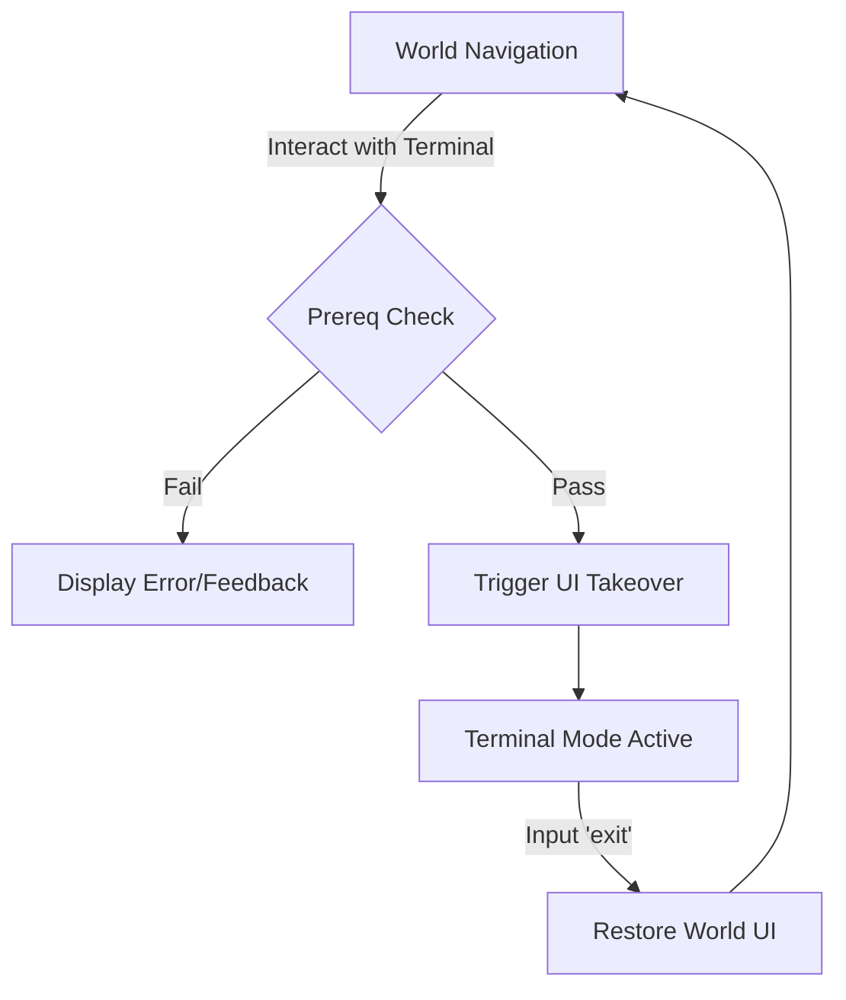
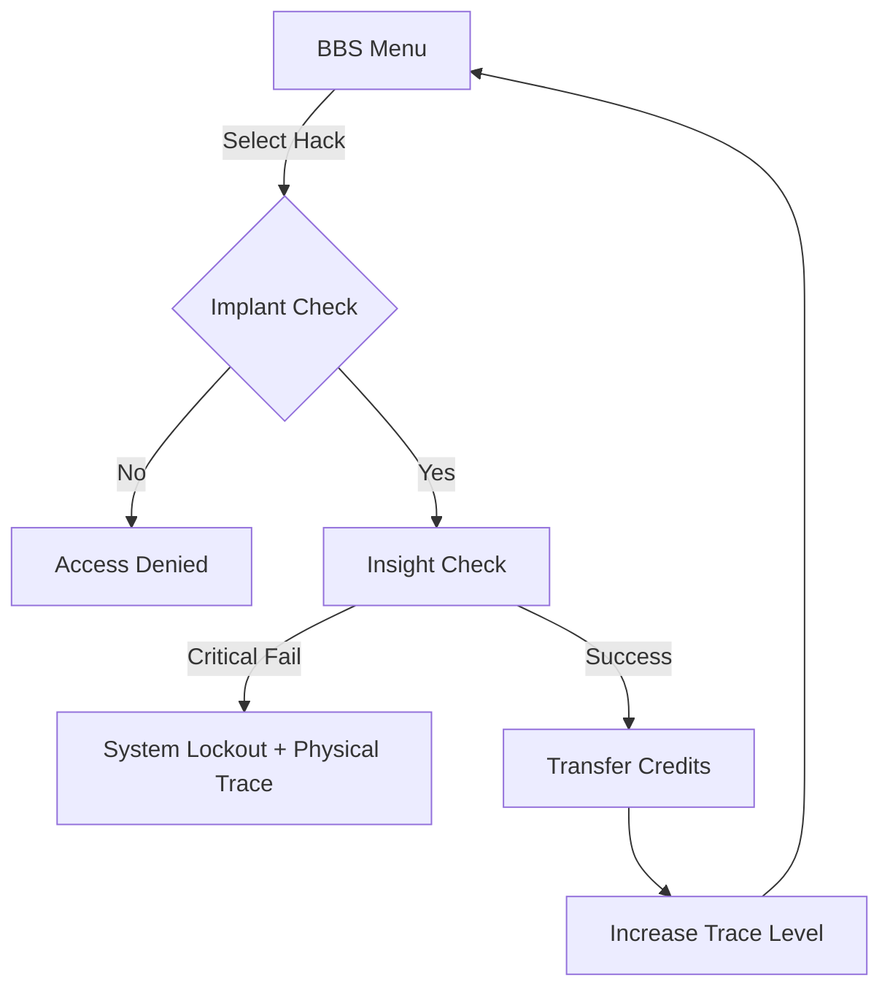

# Terminal and Console System Design

> *"The screen doesn't just show the code. It is the only reality that matters while you're jacked in. The rest of the world is just background noise."*

---

## 1. Overview
The **Terminal and Console System** is a dedicated gameplay mode in *Terra Agnostum* that triggers when a player interacts with a Technate console, an ancient terminal, or a secured data port. It shifts the game from a visual-narrative experience to a retro-futuristic CLI (Command Line Interface) "UI Takeover," focusing on high-stakes hacking, data retrieval, and BBS-style navigation.

---

## 2. UI Takeover: Terminal Mode

### 2.1 Visual Transition
When "jacking in" or "accessing" a terminal:
- **Visual Blackout:** The main game viewport (the generated image) is hidden or blurred behind a heavy scanline overlay.
- **Color Palette:** Transitions to high-contrast CRT colors (e.g., Amber #FFB000, Phosphor Green #33FF33, or Technate Purple #B084E8).
- **Typography:** Switches to a monospaced font (e.g., 'Fira Code', 'Courier New', or 'Glass TTY').
- **Effects:** Slight CRT curvature, flicker, and static "noise" on the edges of the screen.

### 2.2 UI Layout
- **Header:** System status, current Stratum ID, and latency/signal strength.
- **Main Output:** A scrollable text area for CLI output and BBS menus.
- **Input Line:** A prompt (e.g., `guest@terra_agnostum:~$ _`) for user commands.
- **Sidebar (Optional):** Current Creds, active Hacking Implants, and Insight/Perception stats.

---

## 3. Core Mechanics

### 3.1 Prerequisite Checks
Accessing a terminal requires specific hardware or biological enhancements:
1. **[CRED CHIP]**: Required for basic financial transactions and standard terminal access.
2. **[HACKING IMPLANT]**: Required for "illegal" actions (e.g., Hacking for Credits, Overriding Door Locks).
3. **[RESONANT COUPLER]**: Required for interacting with Astral-linked terminals or Faen "Bio-Terminals."

### 3.2 Hacking for Credits
Players can siphon credits from Technate nodes if they meet the requirements.
- **Stat Check:** Uses `AWR` (specifically **Insight**) to find security holes in the data-stream.
- **Risk/Reward:** Higher Insight allows for deeper siphoning, but increases the chance of a "Trace" (which could lead to a physical combat encounter after jacking out).
- **Process:**
    - Player selects `[2] SIPHON CREDITS` from a BBS menu or types `hack --credits`.
    - A brief "decoding" animation/sequence occurs.
    - System reports: `[SUCCESS]: 250 CREDITS EXTRAPOLATED. SIGNAL TRACE AT 15%.`

### 3.3 BBS-Style Menus
Terminals use a simplified menu system for ease of use while maintaining the retro vibe.
```text
--- TECHNATE NODE 0x4F2A ---
[1] Read Local Logs
[2] System Diagnostics
[3] Siphon Credits (Requires Hacking Implant)
[4] Unlock Sub-Level 2
[5] Log Out
> _
```

---

## 4. Integration with Stats (RPG Mechanics v2)

The system leverages the `AWR (Receptor)` pool to determine terminal effectiveness:

| Stat | Function in Terminal | Lore |
|------|----------------------|------|
| **Perception** | Spotting hidden files, identifying physical tampering on the terminal, detecting physical threats while jacked in. | Perceiving the "Hardware" layer. |
| **Insight** | Decoding encrypted streams, bypassing firewalls, siphoning credits, sensing "ghost" data from other Strata. | Perceiving the "Signal" layer. |
| **Conviction** | Asserting a "Fict" to force a terminal to accept a false password or override a hard lock. | Overwriting the terminal's reality. |

---

## 5. System Flows

### 5.1 Terminal State Transition


### 5.2 Hacking Flow


---

## 6. Implementation Notes for Developer
- **State Management:** Use `stateManager.setTerminal(true)` to toggle the UI.
- **Visuals:** Use CSS filters (`brightness`, `contrast`, `blur`) and a pseudo-element for scanlines to achieve the CRT effect without replacing the entire DOM.
- **Command Handling:** Expand `js/terminalSystem.js` to handle more complex commands and menu states.
- **Audio:** Add "mechanical keyboard" click sounds and low-frequency "hum" for immersion.
