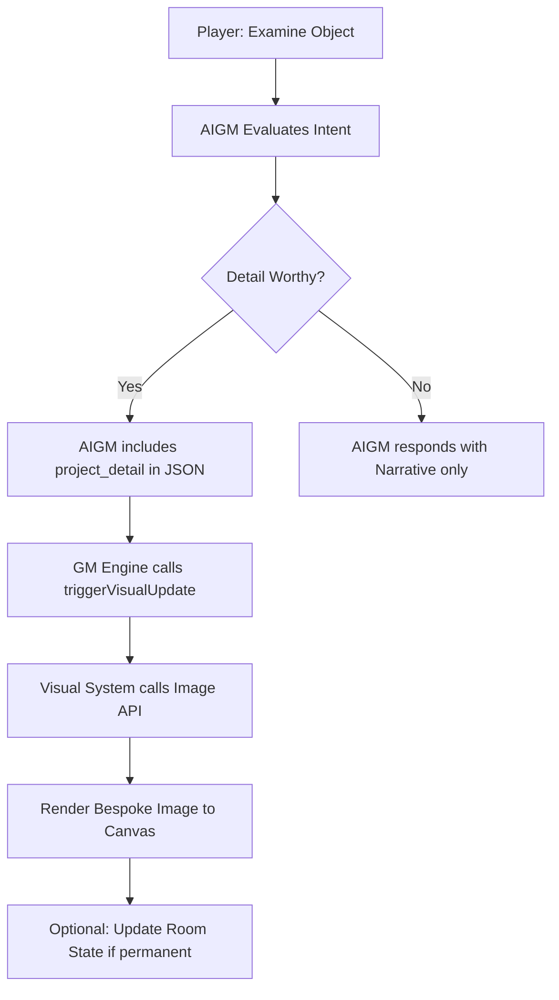

# Bespoke Detail Projections (AIGM Visual Expansion)

## Overview
The AIGM should be able to trigger new, more detailed images when a user pays close attention to something (e.g., `> Examine the diagrams on the door`). This allows for dynamic world-building and visual storytelling that goes beyond the base room description.

## Proposed Changes

### 1. JSON Schema Update (`js/gmEngine.js` & `js/contextEngine.js`)
Add a new field to the AIGM response schema: `project_detail`.

```json
{
  "project_detail": {
    "prompt": "Detailed charcoal circuit schematics and alchemical sigils on a weathered wood door.",
    "is_permanent": false
  }
}
```

- `prompt`: The visual description for the image generator.
- `is_permanent`: If `true`, this image becomes the new `storedImageUrl` for the room. If `false`, it's a temporary "zoom-in" that lasts until the next room change or look action.

### 2. GM Engine Logic (`js/gmEngine.js`)
Update `handleGMIntent` to check for `res.project_detail`.

```javascript
if (res.project_detail) {
    const { prompt, is_permanent } = res.project_detail;
    if (triggerVisual) {
        // We pass a special flag to visualSystem to indicate this is a detail, not necessarily a room rebuild
        triggerVisual(prompt, is_permanent);
    }
}
```

### 3. Visual System Logic (`js/visualSystem.js`)
Modify `triggerVisualUpdate` to handle the `isPermanent` flag.

- If `isPermanent` is `false`, we render the image but **do not** upload it to Firebase as the room's `storedImageUrl`. We store it in `sessionVisualCache` under a temporary key or handle it as a volatile layer.
- If the user moves to a different room and back, they should see the base room image again (unless the detail was permanent).

### 4. UI Feedback (`js/ui.js`)
Add a small indicator or a "Zoom Out" button if the player is looking at a detail. (Optional, can be handled narratively).

## Mermaid Workflow



## Next Steps
- Switch to **Code Mode** to implement these changes.
- Start with `js/contextEngine.js` to update the instructions for the AIGM.
- Update `js/gmEngine.js` to handle the new JSON property.
- Update `js/visualSystem.js` to handle non-permanent visual triggers.
