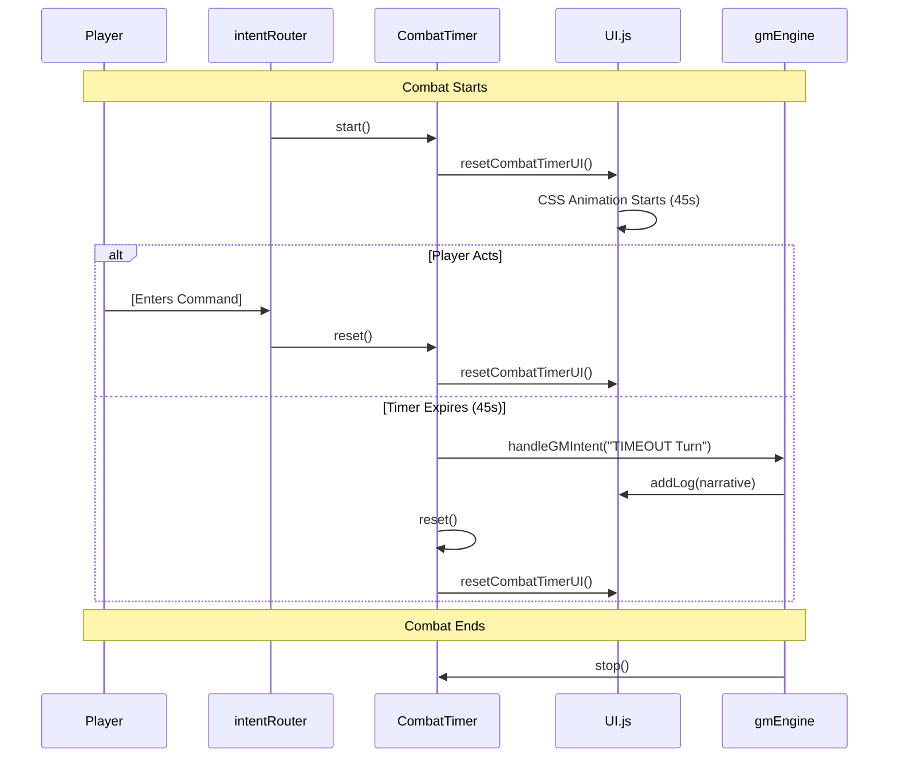

# Combat Timer System - Technical Design Specification

## 1. Overview
The Combat Timer System enforces a 45-second turn limit during combat. If the player fails to act within this window, the system automatically triggers a "Basic Logic" turn narrated by the AI GM.

## 2. CombatTimer Module (`js/combatTimer.js`)
A new module to manage the JS-side countdown and trigger events.

```javascript
// js/combatTimer.js
import * as stateManager from './stateManager.js';
import { handleGMIntent } from './gmEngine.js';
import * as UI from './ui.js';

let timerInterval = null;
const TURN_DURATION = 45000; // 45 seconds

export function start() {
    stop(); // Ensure no duplicate timers
    const startTime = Date.now();
    
    // Update state to reflect timer start
    stateManager.updatePlayer({ 
        combat: { 
            ...stateManager.getState().localPlayer.combat,
            timerStartedAt: startTime 
        } 
    });

    timerInterval = setTimeout(() => {
        handleTimeout();
    }, TURN_DURATION);
    
    // Sync UI Animation
    UI.resetCombatTimerUI();
}

export function stop() {
    if (timerInterval) {
        clearTimeout(timerInterval);
        timerInterval = null;
    }
}

export function reset() {
    stop();
    start();
}

async function handleTimeout() {
    UI.addLog("[SYSTEM]: TURN TIMEOUT. PROCEEDING WITH IDLE NARRATION...", "var(--term-amber)");
    
    // Trigger "Basic Logic" move via GM Engine
    const state = stateManager.getState();
    const actions = {}; // Actions usually passed from main.js/intentRouter
    
    // Special instruction for the GM
    const timeoutInstruction = "PLAYER IDLE TIMEOUT: The player did not act in time. Narrate a turn where they hesitate or are caught off guard, and the enemy takes an opportunistic action (Basic Logic).";
    
    await handleGMIntent(timeoutInstruction, state, actions, false);
    
    // Reset timer for the next turn if combat is still active
    if (stateManager.getState().localPlayer.combat.active) {
        reset();
    }
}
```

## 3. State Management (`js/stateManager.js`)
Modify `initialState.localPlayer.combat` to include timer metadata.

- `combat.timerStartedAt`: Timestamp (ms) of when the current timer started.
- `combat.active`: Existing boolean, used to show/hide the timer.

## 4. GM Engine Integration (`js/gmEngine.js`)
The `handleGMIntent` function already supports a `val` parameter. When a timeout occurs:
1. `handleGMIntent` is called with a specific "TIMEOUT" string.
2. The AI's system prompt or the user prompt will explicitly state that the player was idle.
3. The AI's response (narrative) is displayed in the terminal as usual.

## 5. UI Synchronization (`js/ui.js`)
Add a helper to reset the CSS animation.

```javascript
// js/ui.js
export function resetCombatTimerUI() {
    const timerBar = document.getElementById('combat-timer-bar');
    if (timerBar) {
        timerBar.classList.remove('timer-active');
        void timerBar.offsetWidth; // Force reflow to restart animation
        timerBar.classList.add('timer-active');
    }
}
```

## 6. Lifecycle Integration Hooks
- **`js/ui.js` -> `toggleCombatUI(active, ...)`**: 
    - If `active` is true: Call `CombatTimer.start()`.
    - If `active` is false: Call `CombatTimer.stop()`.
- **`js/intentRouter.js` -> `handleCommand(cmd)`**:
    - If `localPlayer.combat.active` is true: Call `CombatTimer.reset()` after processing the command.
- **`js/gmEngine.js` -> `handleGMIntent(...)`**:
    - If the AI ends combat (`res.combat_active === false`): Call `CombatTimer.stop()`.

## 7. Mermaid Sequence Diagram

